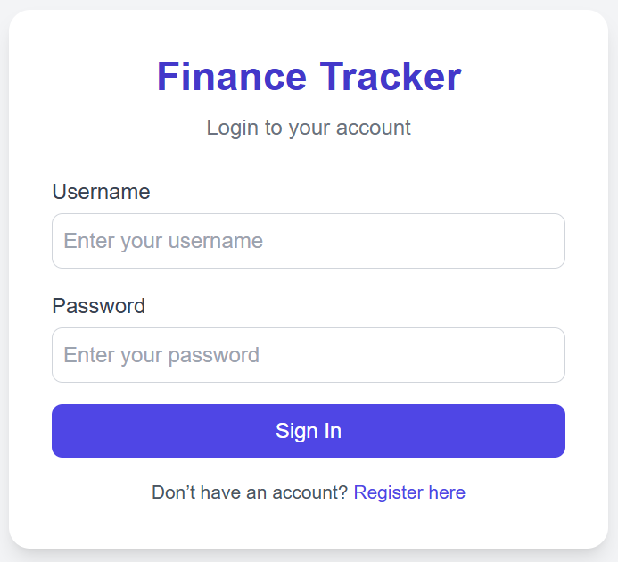
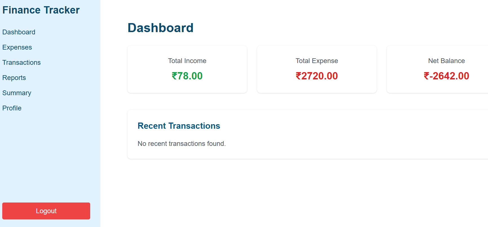
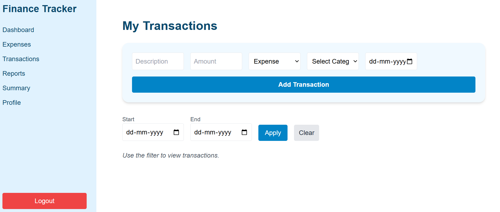
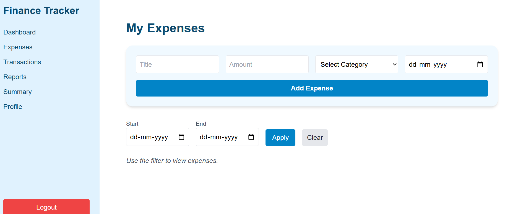
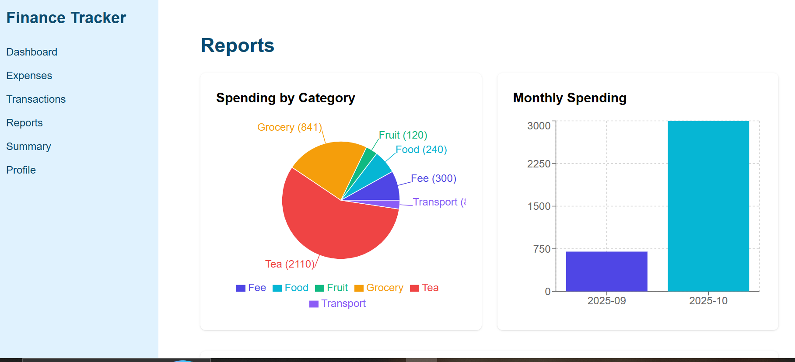
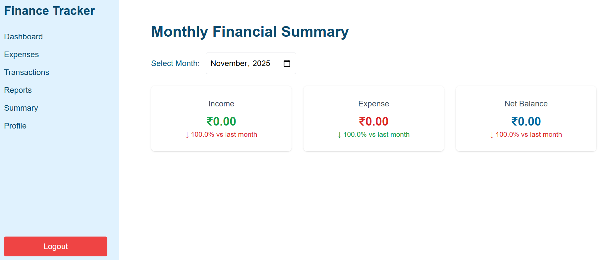
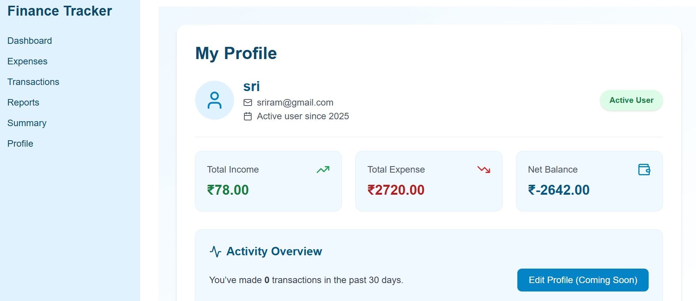

#  Finance Tracker — Full-Stack Web Application

**Project:** Personal Finance Tracker  
**Tech Stack:** Spring Boot (Java), MySQL, React + Vite, JWT Authentication, Tailwind CSS, Recharts

A complete full-stack application to manage personal finances, track transactions, view summaries, and analyze spending using interactive charts.

---

## Features
-  User registration & login (JWT)
-  Add / update / delete transactions & expenses
-  Category selection for each entry
-  Dashboard with total income, total expense, net balance & recent transactions
-  Reports with category-wise and month-wise charts
-  Date-range filters for both transactions & expenses
-  Responsive UI with Tailwind CSS

---

## Folder Structure
```
finance-tracker-fullstack/
│
├── tracker/            → Spring Boot backend
├── frontend/           → React + Vite frontend
├── screenshots/        → All app UI screenshots (PNG)
│   ├── login.png
│   ├── dashboard.png
│   ├── transactions.png
│   ├── expense.png
│   ├── reports.png
│   ├── summary.png
│   └── profile.png
├── README.md
└── .gitignore

```

---

## Prerequisites
- Java 17+
- Maven installed
- Node.js 18+ with npm
- MySQL Server
- (Optional) Postman

---

##  Backend Setup (Spring Boot)

1. Open the **tracker** folder in IntelliJ / Eclipse as a Maven project.

2. Update your database credentials in:
tracker/src/main/resources/application.properties


Add your MySQL details:
```
spring.datasource.url=jdbc:mysql://localhost:3306/finance_tracker
spring.datasource.username=YOUR_DB_USER
spring.datasource.password=YOUR_DB_PASS
spring.jpa.hibernate.ddl-auto=update

```
3. Run the backend:
 ```
cd tracker
mvn clean spring-boot:run
```

Backend runs at:  
http://localhost:8080

---

##  Frontend Setup (React + Vite)

1. Install frontend dependencies:
 ```
cd frontend
npm install
```
3. Start frontend server:
 `npm run dev`

Frontend runs at:  
http://localhost:5173

---

##  API Endpoints

### Authentication
```
POST /users/register
POST /users/login
GET /users/profile
```
JWT header format:
`Authorization: Bearer <your_jwt_token>`

### Transactions
```
POST /transactions/add
GET /transactions/my?start=YYYY-MM-DD&end=YYYY-MM-DD
GET /transactions/summary/my
DELETE /transactions/{id}
```
### Expenses
```
POST /expenses/add
GET /expenses/my
GET /expenses/summary/category
GET /expenses/summary/monthly
```
---

## Screenshots

### Login Page


### Dashboard


### Add Transaction


### Add Expense


### Reports & Charts


### Summary Page


### Profile Page



---

##  Assumptions & Notes
- `node_modules` is ignored using `.gitignore`
- Backend must be running before the frontend
- JWT is required for protected routes
- Categories should already exist in the database

---

## Bonus Features Implemented
- JWT authentication fully integrated
- Recharts for interactive data visualization
- Tailwind CSS for responsive design
- Proper frontend-backend separation
- Clean directory structure

---

## License
This project is open-source and free to use.
